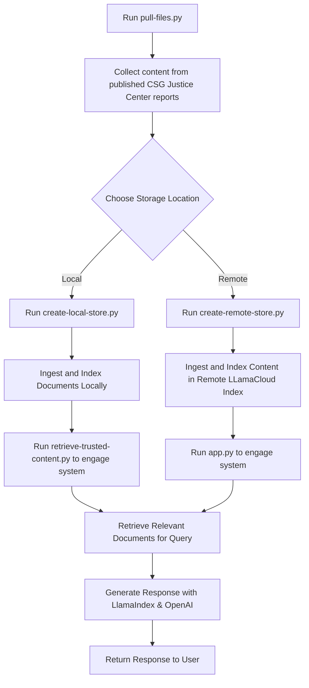

# Local and Remote Retrieval-Augmented Generation (RAG) Experiments

## Overview
This project aims to implement a local and cloud-based RAG (Retrieval-Augmented Generation) systems using the LlamaIndex and OpenAI APIs. Why you ask? Well so much of our knowledge is stored in archival document or on our website. The idea here is to leverage these technologies to can ingest all this database all this knowledge in a single location, making it easily accessible for retrieval through natural language prompts. 

## Process

After the information is retrieved using `pull-files.py`, the data is stored into a vector index, either locally or remotely.

Locally, the RAG can be run using by running `retrieve-trusted-content.py`, this script completes the RAG system by loading the previously created vector index, performing semantic search to find relevant document chunks based on user queries, and then sending both the question and retrieved excerpts to the LLM (here GPT-5 🚀) with strict instructions to answer only based on the provided content. It operates as a command-line tool and at this point we have added prompt guardrails that ensure responses are somewhat grounded in the actual document collection rather than the AI's general knowledge. With this approach, we hope to improve the accuracy and confidence for transparency. Yet, hallucination are not unavoidable and a real possibility.

## TODO 

- [ ] Explore how to bring down 'projects' (e.g. JRI) rather that just 'documents' from the site
- [ ] Investigate how to curate this input list of documents to remove irrelevant content
- [ ] Add a GUI (see Streamlit example in `app.py`)
- [ ] Investigate a vector database rather than an index

